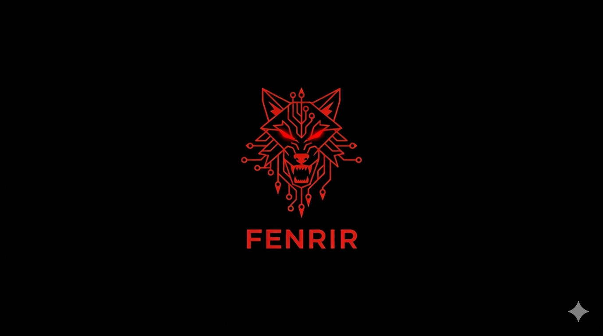

<p align="center">
  
</p>

<p align="center">
  
  
  
  
  
</p>

---

Fenrir is an AI-powered network security scanner built for penetration testers and security researchers. It combines fast network discovery, deep service enumeration, vulnerability scanning, and exploit lookup into a single war room interface — with an LLM analyzing every finding in real time.

Inspired by Armitage, rebuilt from scratch with a modern dark UI, a 5-phase workflow, and DeepSeek AI integrated at every step.

---

## Features

### Scanning
- **ARP sweep** — discovers all live hosts on a local network in under 3 seconds, cannot be blocked by host firewalls
- **Parallel OS detection** — fingerprints operating systems on up to 5 hosts simultaneously using nmap `-O`
- **Deep service scan** — nmap `-sV -sC` per host, identifies services, versions, and banners. Runs sequentially to prevent memory overload
- **Vulnerability scan** — nuclei with 5,000+ templates scans all discovered HTTP/HTTPS services. Findings enriched with CVE IDs and CVSS scores from the NVD API
- **Exploit lookup** — searchsploit automatically matches findings to exploit-db entries. Metasploit module search per CVE

### AI
- **Per-finding analysis** — DeepSeek analyzes every critical and high severity finding individually: what it is, how it's exploited, how to fix it
- **Phase summaries** — AI summarizes what was found after detection and vulnerability scan phases
- **Pentest report generation** — structured report with executive summary, technical findings sorted by severity, and a prioritized remediation roadmap
- **Retry logic** — 3 retries with exponential backoff on rate limits and timeouts

### Interface
- **5-phase war room** — Detection → Port Scan → Vuln Scan → Exploitation → Report. Phase tabs with live status indicators
- **Network topology map** — SVG visualization showing hosts as nodes, color-coded by severity, animated pulse on compromised hosts
- **Live terminal** — all tool output streams to a filterable console at the bottom. Filter by level: ALL / ERROR / WARN / OK / INFO. Pause and resume scrolling
- **Host cards** — show OS icon, open ports, top vulnerability severity. Update live as scans progress
- **Deduplication** — findings deduplicated at both the nuclei output and database level
- **Session isolation** — hosts and findings scoped to the active scan session, no cross-session contamination

---

## How it works

```
Phase 1 — Detection
  nmap ARP sweep → finds all live hosts in ~2 seconds
  nmap -O fingerprints OS on each host (parallel batches of 5)
  AI summarizes the network

Phase 2 — Port Scan
  nmap -sV -sC per selected host (sequential, one at a time)
  Identifies open ports, services, and versions
  Progress bar shows current host / total

Phase 3 — Vulnerability Scan
  nuclei runs against all HTTP/HTTPS services per host
  NVD API enriches each CVE with CVSS score and description
  DeepSeek analyzes each critical/high finding
  AI writes a threat summary

Phase 4 — Exploitation
  searchsploit looks up exploit-db matches per finding
  Metasploit searches for matching modules per CVE
  AI runs exploit recon: attack surface, likely impact, method
  Dry-run generates exact msfconsole command
  Live execution available with DRY_RUN=false

Phase 5 — Report
  Select any past scan session
  DeepSeek writes a full penetration test report
  Executive summary, technical findings, remediation roadmap
  Export as markdown
```

---

## Stack

| Component | Technology |
|---|---|
| Frontend | React 18, Vite, Zustand |
| Typography | Inter (UI), JetBrains Mono (terminal/code) |
| Backend | FastAPI, Python 3.12 |
| Database | SQLite via SQLAlchemy |
| AI | OpenRouter — DeepSeek Chat |
| Host discovery | nmap (ARP sweep, OS detection) |
| Port scanning | nmap -sV -sC |
| Vulnerability scanning | nuclei v3 + NVD API |
| Exploit lookup | searchsploit, Metasploit Framework |

---

## Requirements

- Python 3.12+
- Node.js 18+
- nmap
- nuclei v3
- searchsploit (optional — for exploit lookup)
- Metasploit Framework (optional — for module search)
- OpenRouter API key (free tier available)

---

## Installation

### 1. Clone and set up Python environment

```bash
git clone https://github.com/finnmagnuskverndalen/fenrir.git
cd fenrir
python3 -m venv venv
source venv/bin/activate
pip install -r requirements.txt
```

### 2. Install scanning tools

```bash
# nmap
sudo apt install nmap -y

# Allow nmap to run without sudo
sudo setcap cap_net_raw,cap_net_admin+eip $(which nmap)

# nuclei (requires Go)
sudo apt install golang-go -y
go install -v github.com/projectdiscovery/nuclei/v3/cmd/nuclei@latest
echo 'export PATH=$PATH:$HOME/go/bin' >> ~/.bashrc && source ~/.bashrc

# Download nuclei templates (~500MB, required)
nuclei -update-templates

# searchsploit (optional)
sudo git clone https://gitlab.com/exploit-database/exploitdb.git /opt/exploitdb
sudo ln -sf /opt/exploitdb/searchsploit /usr/local/bin/searchsploit
git config --global --add safe.directory /opt/exploitdb
```

### 3. Fix Linux file watcher limit (required on Linux)

```bash
echo fs.inotify.max_user_watches=524288 | sudo tee -a /etc/sysctl.conf
sudo sysctl -p
```

### 4. Configure environment

```bash
cp .env.example .env
```

Edit `.env`:

```env
OPENROUTER_API_KEY=your_key_here
OPENROUTER_MODEL=deepseek/deepseek-chat
DRY_RUN=false
ALLOW_PUBLIC_IPS=false
```

Get a free API key at [openrouter.ai/keys](https://openrouter.ai/keys).

### 5. Define authorized scope

```bash
# Find your network range
ip route | grep src

# Add to scope.txt
echo "192.168.x.0/24" > scope.txt
```

### 6. Start Fenrir

```bash
./start.sh
```

Open **http://localhost:5173**

---

## Configuration

All configuration is in `.env`:

| Variable | Default | Description |
|---|---|---|
| `OPENROUTER_API_KEY` | — | Required. Get free at openrouter.ai/keys |
| `OPENROUTER_MODEL` | `deepseek/deepseek-chat` | AI model to use |
| `DRY_RUN` | `true` | Set `false` to enable real exploitation |
| `ALLOW_PUBLIC_IPS` | `false` | Set `true` to scan external targets |
| `NVD_API_KEY` | — | Optional. Increases NVD rate limits |
| `HOST` | `127.0.0.1` | Backend bind address |
| `PORT` | `8765` | Backend port |

---

## AI model options

| Model | Input / Output (per 1M tokens) | Notes |
|---|---|---|
| `deepseek/deepseek-chat` | $0.32 / $0.89 | Recommended. Best security knowledge |
| `meta-llama/llama-3.3-70b-instruct` | Free | Zero cost |
| `google/gemini-2.0-flash-exp` | Free | Zero cost, fast |
| `mistralai/mistral-small-3.1` | $0.10 / $0.30 | Good balance |

A full scan with 47 findings, per-finding AI analysis, and report generation costs approximately **$0.02** with DeepSeek.

---

## Project structure

```
fenrir/
├── backend/
│   ├── main.py                  # FastAPI app, all API endpoints
│   ├── config.py                # Settings and scope validation
│   ├── audit.py                 # Append-only action logger
│   ├── database.py              # SQLite models (Session, Host, Port, Finding)
│   ├── websocket.py             # WebSocket broadcast to frontend
│   └── phases/
│       ├── host_discovery.py    # ARP sweep + parallel OS detection
│       ├── port_scan.py         # nmap -sV -sC, skips redundant ping sweep
│       ├── vuln_scan.py         # nuclei + NVD enrichment + deduplication
│       └── exploit.py           # searchsploit + Metasploit module search
├── ai/
│   ├── analyst.py               # Per-finding analysis, retry logic
│   └── reporter.py              # Pentest report generation
├── frontend/
│   └── src/
│       ├── App.jsx
│       ├── index.css
│       ├── store/
│       │   └── fenrirStore.js   # Zustand global state
│       ├── hooks/
│       │   └── useWebSocket.js  # Singleton WS connection, message dedup
│       ├── components/
│       │   ├── Header.jsx       # Phase tabs, live counters, scan progress
│       │   ├── HostCard.jsx     # Host display with OS, ports, severity
│       │   ├── NetworkMap.jsx   # SVG topology visualization
│       │   └── Terminal.jsx     # Filterable live console
│       └── pages/
│           ├── Phase1Detection.jsx    # ARP sweep, OS fingerprint, network map
│           ├── Phase2PortScan.jsx     # Port scan with progress bar
│           ├── Phase3VulnScan.jsx     # Vuln scan, findings list, AI analysis
│           ├── Phase4Exploitation.jsx # Exploit lookup, MSF modules, agent log
│           └── Phase5Report.jsx      # Report generation and download
├── reports/                     # Generated reports (auto-created)
├── start.sh                     # Single command launcher
├── run.py                       # Backend entrypoint
├── scope.txt                    # Authorized CIDR ranges
├── audit.log                    # Append-only action log (auto-created)
├── .env.example
├── requirements.txt
└── Dockerfile
```

---

## Safety and authorization

> **This tool is for authorized security testing only. Only scan networks and systems you own or have explicit written permission to test. Unauthorized scanning is illegal.**

Fenrir has multiple layers of safety controls:

- **Scope enforcement** — `scope.txt` defines authorized CIDR ranges. Any target outside scope returns HTTP 403 and is logged. The scan never starts
- **Duplicate scan prevention** — the backend blocks concurrent scans against the same target
- **Dry run mode** — exploitation features generate commands but do not execute them. Set `DRY_RUN=false` in `.env` to enable real execution
- **Public IP blocking** — external IP ranges are blocked by default. Set `ALLOW_PUBLIC_IPS=true` to enable
- **Audit log** — every action (scan start, phase transitions, exploit attempts) is logged with timestamp to `audit.log`. The log is append-only and never truncated

---

## API reference

| Method | Endpoint | Description |
|---|---|---|
| POST | `/api/scan/start` | Start a scan session |
| GET | `/api/sessions` | List all scan sessions |
| GET | `/api/sessions/{id}/hosts` | Hosts for a session |
| GET | `/api/sessions/{id}/findings` | Findings for a session |
| GET | `/api/findings` | All findings (filter: `?severity=high`) |
| GET | `/api/hosts` | All hosts |
| POST | `/api/ai/summarize` | AI phase summary |
| POST | `/api/ai/test` | Test AI connectivity |
| POST | `/api/reports/generate/{id}` | Generate pentest report |
| GET | `/api/reports/list` | List saved reports |
| GET | `/api/reports/download/{filename}` | Download a report |
| POST | `/api/exploits/lookup` | searchsploit lookup |
| GET | `/api/exploits/metasploit/{cve}` | Metasploit module search |
| POST | `/api/exploits/run` | Run exploit (dry-run by default) |
| GET | `/api/health` | Backend status and active scans |
| GET | `/api/audit` | Audit log entries |
| GET | `/api/scope` | Authorized scope |
| WS | `/ws` | Live WebSocket feed |

---

## Milestones

- [x] **M1** — Project scaffold
- [x] **M2** — Backend core (FastAPI, SQLite, WebSocket, scope guard, audit log)
- [x] **M3** — Scan phases (two-phase nmap, nuclei, NVD enrichment, live streaming)
- [x] **M4** — AI analysis (DeepSeek via OpenRouter)
- [x] **M5** — Frontend polish (expandable findings, DB-backed, host drilldown)
- [x] **M6** — Report generator (structured pentest report, markdown export)
- [x] **M7** — Exploit layer (searchsploit, Metasploit module search, dry-run)
- [x] **M8** — Fenrir v2 UI (5-phase war room, live terminal, host cards, network map)
- [x] **M9** — Stability and UX overhaul (singleton WebSocket, deduplication, sequential scanning, per-finding AI, retry logic, terminal filters, session isolation)
- [ ] **M10** — Docker packaging, PDF export, API authentication

---

## License

MIT — see [LICENSE](LICENSE)

---

<p align="center">
  Built by <a href="https://github.com/finnmagnuskverndalen">finnmagnuskverndalen</a>
</p>
